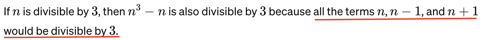
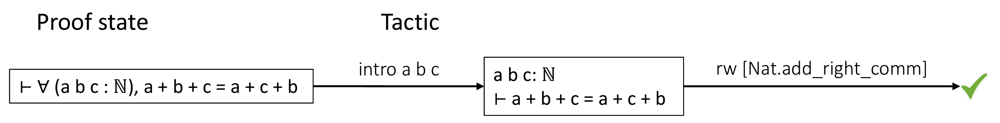
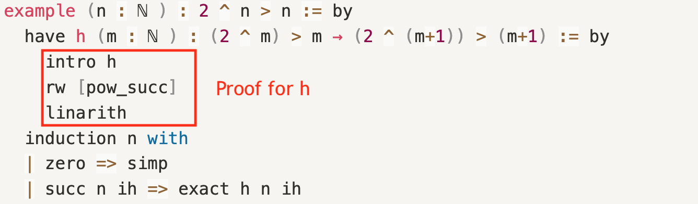
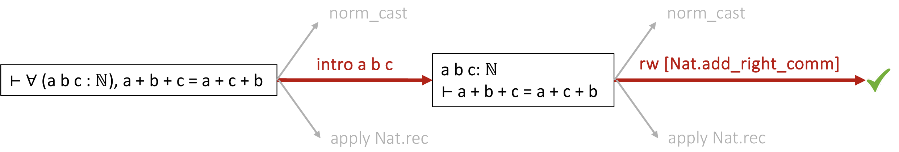
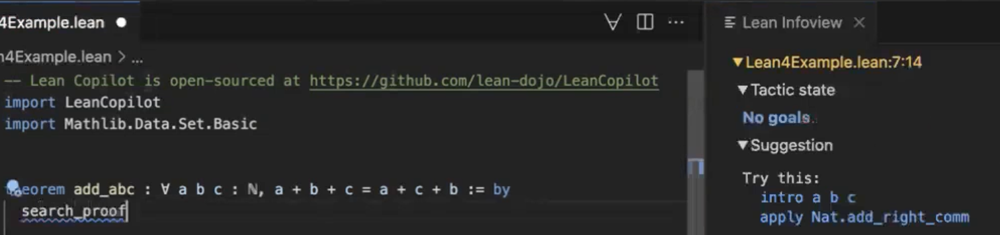
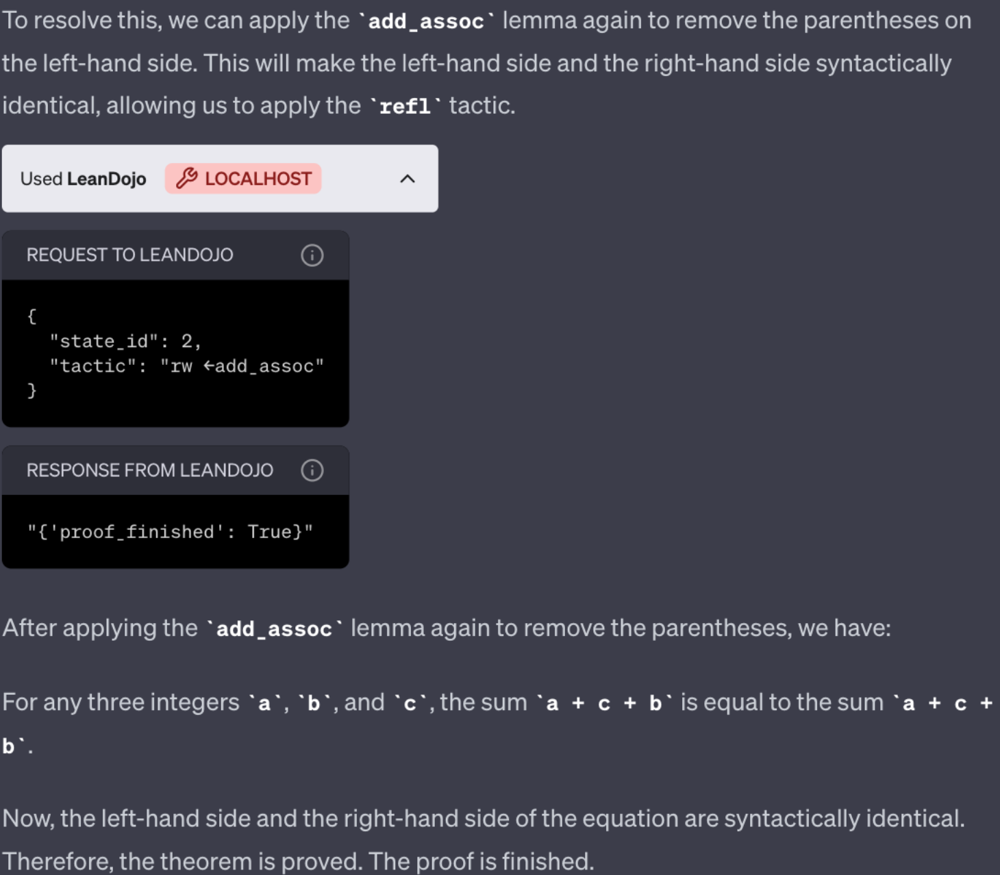
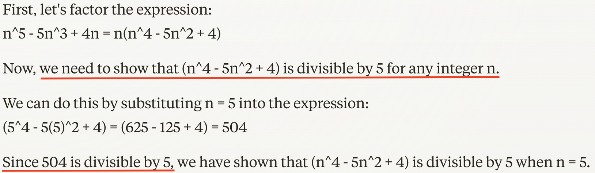
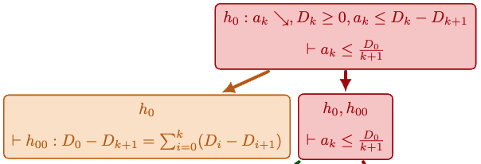
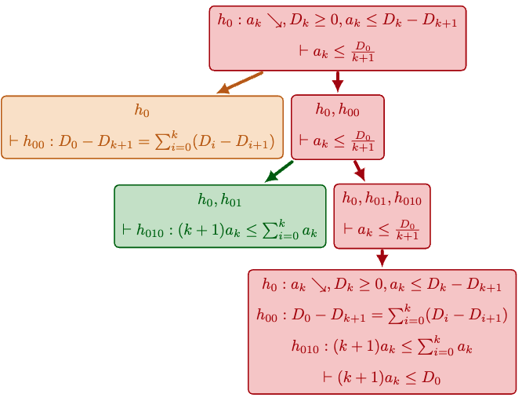
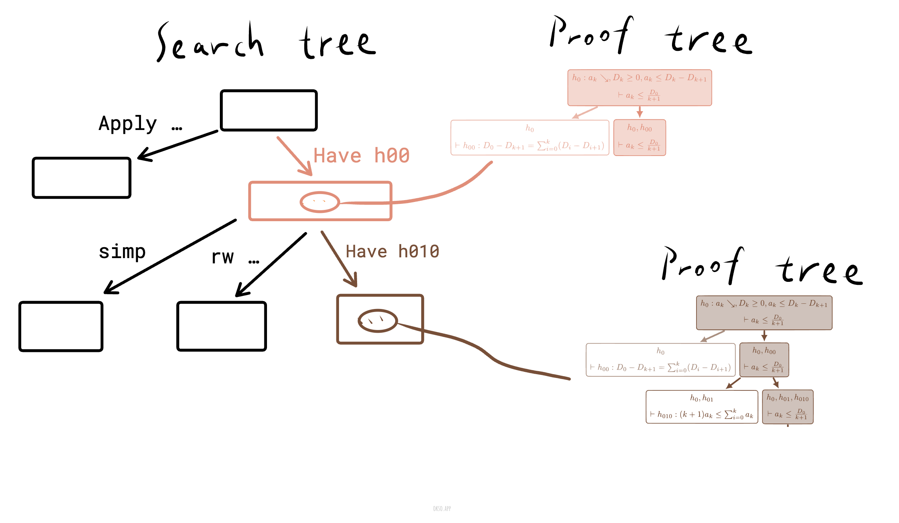

<!---
https://marp.app/docs
https://github.com/rnd195/my-marp-themes/blob/main/beamer.css
-->

# <!--fit--> Let AI Explain Math
<!-- _class: lead -->

(Ongoing) AbductiveTP: Abduction via Analogical Divide-and-conquer Planning Facilitates Formal Mathematical Reasoning

Presented by Zory Zhang @ 

Apr 25, 2024

# Is GPT Your Husband?
- Me: "Show $3 ∣ (n ^ 3 - n)$ for any n"
* ChatGPT 3.5 (Apr 20, 2024):
    <figure>
    
    <figcaption>https://chat.openai.com/share/0d69988d-aedd-4199-9c63-f5c7916c85e5</figcaption>
    </figure>

<!-- headingDivider: 2 -->
<!-- paginate: true -->

# Is GPT Your Husband? (cont')

# 1 The Question
<!-- _class: lead -->

##### "How well can AI explain a mathematical statement in _formal language_"
<!--(e.g. a homework problem that ask for a proof)-->

<!--* Why explain
* Why math-->

## 1.1 Formal Math
* Formal math $\approx$ a programming language
    * Compilation pass :arrow_right: **certifiably correct**
    * Proof in formal math $\approx$ validity **no worry** 

* **Lean 4**: programming language
* **lean prover**: proof assistant $\approx$ compiler

<!--- "checks that these proofs are correct down to their logical foundation"
- logical foundation: dependent type theory (DTT)-->

## 1.1 Formal Math (cont')
- Adapted from <a href="#footnote-4a">[4]</a>:
* 
* 

<h4></h4>
<ol start="4">
    <li id="footnote-4a">Yang et, al. LeanDojo: Theorem Proving with Retrieval-Augmented Language Models. 2023.</li>
</ol>

## 1.3 Contribution

<!--pause here to wake people up-->
We show a technique that 
- improves the ability of *an AI system* 
- to explain mathematical statements 
- in formal language

# 2 What accounts for good explanations
<!-- _class: lead -->
<!-- code -> parsing tree -> show definition is easy -->
<!-- Click a concept -> see definition -->

## 2.1 Explaining what?
* What does the theorem say?
    * IS useful
    * :x: Yet Easy given formalization in code
* :heavy_check_mark: "Why this is a theorem"
    * The hardest part during math courses
    * "Math maturity"

## 2.2 What does a good explanation look like
<!-- 
- A valid proof showing the necessity of the assumptions (E.g. by counter-examples).

- A valid proof showing the sufficiency of the assumptions.

- Connects to knowledge and beliefs the performer already has.

- **Hierarchy/flexibility**: A proof that is structured and to the point in every local step.
-->

* **Necessity**: Why all assumptions are necessary
* **Validity**: Why conclusion follows
* **Past experience**: What does the audience already know
* **Hierarchy/flexibility**: In a moment

## 2.2 What does a good explanation look like (cont')
<!--
Is the yellow box an explanation?
Yes, a very brief one.
So-called “selected” explanation.
I call it hierarchical explanation: take whatever level of detail you want.
The most complete one: a certifiably valid proof.
-->
* Show $\sum_{n=1}^{\infty} \frac{1}{n(n+1)} =1$
* 

## 2.2 What does a good explanation look like (cont')

# 3 Method: How to explain math
* **Reflection of Human Reasoning**

# 3.1 Reflection of Human Reasoning
- Analogy
- Planning

# 3.1.1 Analogy
<!--
Suppose Never learned "proof by induction"

Now you learned a technique without necessarily knowing the name.
* Most of the techniques are nameless.
* Yet you remember them to succeed in the exam.
-->
    
* Lecture: "Prove $2 ^ n > n$ for any n."
    * Can be solved by having inductive hypothesis ih
    * ih: $\forall m \in \mathbb{N}, 2^m > m \implies 2^{m+1} > m+1$
* Homework: "Prove $3 ∣ (n ^ 3 - n)$ for any n."
    * ih: $\forall m \in \mathbb{N}, 3 ∣ (m ^ 3 - m) \implies 3 ∣ ((m+1) ^ 3 - (m+1))$

# 3.1.2 Planning
<!--
If I try to explain A, I decompose it into B and C.
Since B and C are independent, I can explain them separately.
Suppose B is hard, I decompose it into D and E...
-->
* 

# 3 Method: How to explain math
<!-- _class: lead -->
<!-- ah, finally. are you ready? -->

- Reflection of human reasoning
- **How to build AI systems to explain**

## 3.2 How to build AI systems to explain
1. *Necessity*
2. *Validity*
3. *Past experience*
4. *Hierarchy/flexibility*

## 3.2.1 Necessity
<!--An example of a proof goal/state-->
<!--<figure>

<figcaption>Two need justification: 5th and 7th</figcaption>
</figure>-->
* $$A,B \implies C$$
* $$\neg (B \implies C)$$
* $$B \wedge \neg C$$

## 3.2.2 Validity: **Formal Math**
Write proof in formal math $\approx$ validity checker :heavy_check_mark:
<!--A more complicated example:
<figure>
    
    <figcaption>A hierarchical proof</figcaption>
</figure>-->

<!--<figure>
    
    <figcaption></figcaption>
</figure>-->

## 3.2.3 Past experience: **Analogy**
<!--
Q: Analogy between what?
* A: Between the local action that captures the essence
-->

* Express past experience as a **knowledge corpus**
* Draw **analogies** between the current problem and problems in the corpus
* Transfer the whole proof? :x:
* Transfer the **key observation/hypothesis** will be enough

## 3.2.3 Past experience: Analogy (cont')
<!-- the same example. just want to show you this is sufficient -->
* Source
    - "Prove $2 ^ n > n$ for any n."
    - have $ih: \forall m \in \mathbb{N}, 2^m > m \implies 2^{m+1} > m+1$
* Target
    * "Prove $3 ∣ (n ^ 3 - n)$ for any n."
    * \<to_be_completed\>

## 3.2.4 Hierarchy/flexibility: **Search for plan tree**

Recall: (from <a href="#footnote-4c">[4]</a>)

<h4></h4>
<ol start="4">
    <li id="footnote-4c">Yang et, al. LeanDojo: Theorem Proving with Retrieval-Augmented Language Models. 2023.</li>
</ol>

## 3.2.4 Hierarchy/flexibility: **Search for plan tree** (cont')

<figure>

<figcaption>A search tree from <a href="#footnote-4b">[4]</a></figcaption>
</figure>

<h4></h4>
<ol start="4">
    <li id="footnote-4b">Yang et, al. LeanDojo: Theorem Proving with Retrieval-Augmented Language Models. 2023.</li>
</ol>

## 3.2.4 Hierarchy/flexibility: **Search for plan tree** (cont')
<!-- such search for sequential steps is mindless. people make plan before dirty works -->

<figure>

<figcaption>A plan tree</figcaption>
</figure>

## 3.2.4 Hierarchy/flexibility: **Search for plan tree** (cont')
<!-- yellow one and green one are independent. -->
<!-- if I make plan by pointing out key points and decompose the problem, we get a high-quality plan tree. -->

## 3.2.4 Hierarchy/flexibility: **Search for plan tree** (cont')
<!--
BFSer is a baseline that searches sequentially.
DCSer instead, tries to find key observations and decompose the problem.
-->

## 3.2.3 Summary
* *Necessity*: drop a condition and prove the negated goal (flip quantifiers in assmptions as well) :arrow_right: Validity
* *Validity*: **Formal** math language
* *Past experience*: **Analogy**
* *Hierarchy/flexibility*: Search for the **plan tree**

# 4 Implementation

Basically, a few LLMs talking to each other.

# 5 Experiment
<!-- distribution plot: block the result and only show axes first -->

- Dataset = **mathlib**: a unified library of formalized mathematics definitions & theorems in Lean, proven by human experts.
- Pass@1: time limit=10min per theorem, the percentage of theorems proven

# 5 Experiment (cont')
|                | Pass@1 on test set |
|:-----------------------:|:-------------------------------:|
| GPT-4 | 7.4%                               |
|    BFSer (ReProver) <a href="#footnote-4f">[4]</a>   | 30%                              |
|       DCSer[v1]       | 25%                               |

<h4></h4>
<ol start="4">
    <li id="footnote-4f">Yang et, al. LeanDojo: Theorem Proving with Retrieval-Augmented Language Models. 2023.</li>
</ol>

# 6 Implication

~~Help with your homework~~

1. By producing lean proof (VScode extension called LeanDojo <a href="#footnote-4g">[4]</a>)

<h4></h4>
<ol start="4">
    <li id="footnote-4g">Yang et, al. LeanDojo: Theorem Proving with Retrieval-Augmented Language Models. 2023.</li>
</ol>

# 6 Implication (cont')

2. By ChatGPT Extension

    <figure>
        
        <figcaption>LeanDojo paper.</figcaption>
    </figure>

    

# Takeaway
<!-- _class: lead -->

Hierarchical divide-and-conquer planning improves the ability of an AI system to explain mathematical statements in formal language.

# Acknowledgement

Supervisor: Dr. Jiaxuan You @ 

Joint work with:

    

        <figure>
        
        <figcaption>Ziyu Zhou https://subfish-zhou.github.io/</figcaption>
        </figure>
    

    

        <figure>
        
        <figcaption>Haoran Zhao https://haoranzhao419.github.io/</figcaption>
        </figure>
    

    

        <figure>
        
        <figcaption>Yicheng Wang https://ywangmy.github.io/</figcaption>
        </figure>
    

    

        <figure>
        
        <figcaption>Yan Li @yan-li-8a2205225 on linkedin</figcaption>
        </figure>
    

# Q&A
<!-- _class: lead -->
- Thank you for listening!
- Please contact Zory if you're willing to preview the paper draft / want to have copy of the slides.
- Get notified when it's on arxiv / the open-source software is out? Just follow `@zory_zhang` on X.

# Backup slides

# Is GPT Your Husband? (cont')
- Me: "Show $5 ∣ (n^{5}-5n^{3}+4n)$ for any n"
* Claude 3 Sonnet (Apr 20, 2024): 

## 1.1 Why explain
<!-- many explanation are causal: his early death cannot explain his smoking -->
<!-- many explanation are mechanistic: car is moving because the engine drives the wheel -->
1. Human (Education):
    - **Learn** through the process of explanation <a href="#footnote-1a">[1]</a>
        * Understanding: Evoke *category, causal & mechanistic* thinking
        * Updating: *Incomplete & inconsistent* knowledge from the past

<h4></h4>
<ol>
    <li id="footnote-1a">Lombrozo. Explanation and Abductive Inference. In The Oxford Handbook of Thinking. 2012.</li>
</ol>

## 1.1 Why explain (cont')
1. Human (Education):
    - **Learn** through the process of explanation
    * **Inference** based on explanation <a href="#footnote-1b">[1]</a>
        * Q: Why can't I find my key? 
        * Explanation: It must be in the car (therefore I can't find)
        * Inference: I should check the car
    * **Communication** & **retention**: highlight the key points

<h4></h4>
<ol>
    <li id="footnote-1b">Lombrozo. Explanation and Abductive Inference. In The Oxford Handbook of Thinking. 2012.</li>
</ol>

## 1.1 Why explain (cont')
<!--- knowledge corpus: a good place to draw analogy from-->
        
1. Human (Education)
2. AI (Scientific advances)
    * Explanation-based learning (EBL) <a href="#footnote-2">[2]</a>
        - Emulate "learning through the process of explanation"
    * Explanations (the product) as knowledge corpus <a href="#footnote-3">[3]</a>
        - Solve new problems by transfering seen explanations 

<h4></h4>
<ol start="2">
    <li id="footnote-2">Dejong & Mooney. Explanation-based learning: An alternative view. 1986.</li>
    <li id="footnote-3">E.g. Yoo and Fisher. Concept Formation over Explanations and Problem-Solving Experience. 1991.</li>
</ol>

## 1.2 Why (formal) math
1. ***Accurate*** measure of intelligence
    * (Explicitly) test **abstraction** ability
    * Closed-world
        - No missing information
        - No hidden common sense assumptions

## 1.2 Why (formal) math (cont')
<!--* Math demands and celebrates **understanding**-->

1. ***Accurate*** measure of intelligence
2. ***Easy*** to measure
    * Unambiguous / objective
    * Formal math: a programming language
        - Can be checked **automatically**
        - Compilation pass :arrow_right: **Correctness guaranteed**

- What count as explanation
- What does an good explanation look like

## 2.1 What count as explanation
* Type <a href="#footnote-1a">[1]</a>: 
    * **Mechanistic**: "It is moving because the engine drives the wheel to spin"
    * **Causal**: "It is moving because the wheel is spinning"
    * **Unification / subsumption**: "It is moving because it's a car"
* In math: Mechanistic :heavy_check_mark:

<h4></h4>
<ol>
    <li id="footnote-1a">Lombrozo. Explanation and Abductive Inference. In The Oxford Handbook of Thinking. 2012.</li>
</ol>

# 3.1.1 Planning
<!--- Experts make plans to solve hard problems.-->
<!--Blue ones are the subgoals that all their predecessors are proved.-->
<figure>
    
    <figcaption>https://terrytao.wordpress.com/2023/11/18/formalizing-the-proof-of-pfr-in-lean4-using-blueprint-a-short-tour/
</figcaption>
</figure>

## 3.2.3 Past experience: Analogy (cont')
<!--Where in the proof do you think that captures the essence of the problem?-->
<figure>
    
    <figcaption></figcaption>
</figure>

Now: Prove $3 ∣ (n ^ 3 - n)$ for any n

## 3.2.3 Past experience: Analogy (cont')

<!-- so although the proof is quite different, we draw analogy between essence -->

## 3.2.3 Past experience: Analogy (cont')
* 
* 

## 3.2.5 Plan tree and analogy

Let's try the harder one.

## 3.2.5 Plan tree and analogy (cont')

<!-- Now you get a homework. -->

## 3.2.5 Plan tree and analogy (cont')

<!-- Now we might draw an analogy from another source to obtain another hypothesis in the green box. -->

Source: some other problem-proof pair in the knowledge corpus

# 4 Implementation
* Validity: ReProver <a href="#footnote-4e">[4]</a>
    - Lean as the **verifier**
* Search for **plan tree**
    - LLM as decomposition **proposer**
    - LLM as the evaluator to find the **best plan**: minimize the difficulty of the hardest subgoal after decomposition

<h4></h4>
<ol start="4">
    <li id="footnote-4e">Yang et, al. LeanDojo: Theorem Proving with Retrieval-Augmented Language Models. 2023.</li>
</ol>

# 4 Implementation (cont')
<embed src="../figs/analogyTP.drawio.pdf" width="100%" height=400px type="application/pdf">

# 4 Implementation (cont')
- Analogy: 
    - LLMs: GPT4 / Llama 3 / Claude 3 haiku
    - Learning and Inference with Schemas and Analogies (LISA) <a href="#footnote-5">[5]</a>
    - Structure-Mapping Engine (SME) <a href="#footnote-6">[6]</a>

<h4></h4>
<ol start="5">
    <li id="footnote-5">Hummel & Holyoak. A symbolic-connectionist theory of relational inference and generalization. 2003.</li>
    <li id="footnote-6">Falkenhainer, Forbus & Gentner. The structure-mapping engine: Algorithm and examples. 1989.</li>
</ol>

# 9. Future work
<!-- _class: lead -->
- Add analogy component.
- Further improve score by careful optimization techniques.

## Analogy

- Use analogical inference to suggest a hypothesis.
- Analogy is conducted by explicitly constructing a translation mapping between scenarios and translate the goal decomposition used in the target scenario back to the source scenario.
- E.g. Telescoping trick.

## Planning
- Interactive proof assistant can be viewed as a world model for theorem proving that predicts consequences of proposed actions, which enables planning.
    - IOW, formal math as a special case of general planning.
    - We suggest to implement inference-to-the-best-explanation via a new planning policy based on searching for a divide-and-conquer strategy that reduces the difficulty the most.

## Planning policy
<!-- backgroundColor: white -->

---
<!-- backgroundColor: #{$bg} -->

- Assume we have a objective estimator to evaluate difficulty.
- Prioritize *search tree* branch (tactic) that minimize the value of cost function = $\max_{\text{existing subgoals } s} \{ \text{difficulty}(s) \}$, which is defined on *proof tree*.

# Conclusion
- While analogy provides motivation of the proof, the planning policy encourages the proof to be hierarchically structured and insightful.
- We implement this framework using a neural-symbolic architecture and show that it mitigate the gap between AI and human mathematician on the quality of the produced proof.

# Design elements

 
    

        <figure>
        
        <figcaption>Ziyu Zhou https://subfish-zhou.github.io/ </figcaption>
        </figure>
    

    

        <figure>
        
        <figcaption>Haoran Zhao https://haoranzhao419.github.io/</figcaption>
        </figure>
    

    

        <figure>
        
        <figcaption>Yicheng Wang https://ywangmy.github.io/</figcaption>
        </figure>
    

    

        <figure>
        
        <figcaption>Yan Li @yan-li-8a2205225 on linkedin</figcaption>
        </figure>
    

    <!--
Centered
-->

