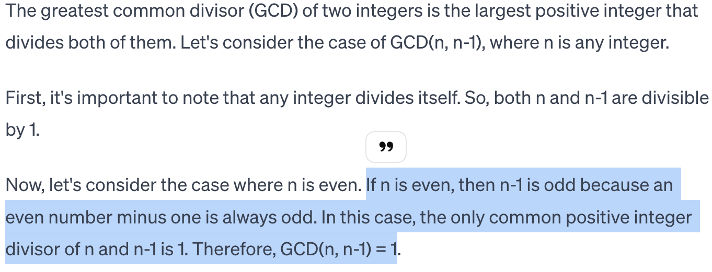

<!---
https://marp.app/docs
https://github.com/rnd195/my-marp-themes/blob/main/beamer.css
-->

# <!--fit--> AI2Reason

Build and characterize artificial reasoning system that is truth-seeking, persuasive, and creative.

By Zory Zhang

<aside>
Version:
- elevator pitch (30s)
- talk with professors (10min): detaillevel1
- talk with interested senior (20min): detaillevel2
- talk with potential collaborators (40min): detaillevel3

Audience can ask for more elaboration on any part of the talk after the standard presentation.
</aside>

# Outline
Goal: introduce and ask for opinion on my long term vision of AI2Reason.

*  What's AI2Reason
*  Why important at this moment
*  Why is it hard but promising now
*  My Next step

<!-- headingDivider: 2 -->
<!-- footer: 2023 Dec, Zory Zhang: Build and Characterize Artificial Reasoning System -->
<!-- paginate: true -->

#  What's AI2Reason

Outline recap:
1. #### **What's AI2Reason**
    - A. Goal
    - A. Some key features
    - B. What aspects of intelligent system are covered?
    - C. What aspects of intelligent system are not covered?
2. Why important at this moment
3. Why is it hard but promising now
4. My Next step

## A. Goal

* :x: just *build* stronger computational model
* :heavy_check_mark: but **characterize** how to let AI reason in a **truth-seeking, persuasive, and creative** manner.

## B. Some key features
* Human reasoning: from everyday problem-solving to scientific innovation.
* Let me examplify.

<aside>
To examplify this idea, I will cover three examples of reasoning abilities at different level ...
</aside>

---

### From **solving math word problems**
* Representative problem-solving skill
    -  Math: just play ground to study reasoning
    -  Formal math language: established play ground
1) :arrow_right: Formulation: translate into formal language
2) :arrow_right: Planning: goal decomposition
3) :arrow_right: Automated reasoning: recursively solve subgoals
<aside>
just like how mathematicians sometimes seriously treat the problem.
They first formulating it into abstract math question first (translate into formal language, which is not covered), planning on how to solve it (planning), and then solving each subgoal one by one (automated theorem prover)
</aside>

<detaillevel3>
<figure>
    
    <picture>
    
    </picture>
    <figcaption><t>Autoformalization with Large Language Models, by Tony Wu(xAI)</t></figcaption>
</figure>
</detaillevel3>

---

### To serve as a **scientific enquiry assistant**
<aside>
given a phenomenon of interest, give hypothesis with explantory power, and conduct thought experiment / propose real world experiment to confirm/develop/deny it
</aside>

* observer
* hypothesis generation
* reasoning on hypothesis as explanation
* thought experiment / real world experiment

<detaillevel1>

</detaillevel1>

---

### To **develop new theory**

- Scientific concept / diagram innovation
- E.g. weight of object :arrow_right:  universal gravity

<detaillevel1>

</detaillevel1>

## C. What aspects of intelligent system are covered?
<aside>
These are just some terminalogies for people who happen to know them.
</aside>

- **Deductive, inductive, abdutive reasoning**

- **Categorization and conceptualization**

- **Planning**

- **Causality**

- **Explanation seeking**

- (All of them are examplified in doing math)

  <detaillevel1>
  
  </detaillevel1>

  <detaillevel1>
  
  </detaillevel1>

## D. What aspects of intelligent system are not covered?
<aside>
We are not as ambitious as you might think. I'd like to clarify some limitation of the diagram for now.
</aside>

- **Perception / visual reasoning / embodied reasoning**.
<aside>

- The input / output is already in / will be a symbolic form, e.g. mathematical formal language, causal relation graph, etc.
- Goal of reasoning is already given and assumed to be understood.

TODO: draw diagram on perception -> cognition
</aside>

- **Decision making and ethics**.
<aside>

- As an assistant.
</aside>

- **Consciousness / self-awareness / active learning**.
<aside>
The motivation of seeking explanatory power, creativity, and the desire to reason are hard-coded in the system. In other word, a zombie AI that has no consciousness.
</aside>

# 2 Why important at this moment

Outline recap:
1. What's AI2Reason
2. #### **Why important at this moment**
    - A. Necessity
    - B. Readiness
    - C. Mutual benefit
    - D. Social impact
3. Why is it hard but promising now
4. My Next step

## A. **Necessity**
<detaillevel3>
- AGI should be able to **develop** **creative** yet still **persuasive** ideas by providing strong reasons to support them.
- Necessity of AI2Reason = necessity of AGI
- Why AGI? Self-improve intelligence :arrow_right: superintelligence :bangbang:
- ~~Who knows how far we are from meeting with aliens? As long as we don't destroy ourselves before that ...~~

<aside>
I'd like to claim the necessity of AI2Reason by reducing it as the question of necessity of AGI.
</aside>
</detaillevel3>

- LLMs **dream/hullucinate/bullshit**. They care about
    - :heavy_check_mark: what word will high likely follow
    - :heavy_check_mark: entertain human
    -  :x: truth
- We :hearts: LLMs because
    - :heavy_check_mark: creativity
    -  :x: intelligent system with strong generalization

<detaillevel2>

- E.g. Ask "show me why gcd (n,n-1) = 1":

  

</detaillevel2>

## B. **Readiness**
- More feasible than ever. We can
    - :repeat_one: **neuralize** many modules via auto-differentials
    - :speech_balloon: make use of the infinite expressive power of **natural language**
    - :thought_balloon: take LLMs as working (not satisfying) **creative engine**
- GPT-4 system:
    - working example
    - isn't doing that bad.
## B. **Readiness** cont'
- Psychologists and philosophers have been studying reasoning for a while.
- Programming logic community have been studying logic for a while.
- Recent progress: TODO

## C. **Mutual benefit**
- Mutual benefit between areas
- :arrow_backward: Taking inspiration from theories on reasoning to AI facilitates the development of AGI.
- :arrow_forward: At the same time, building computational model is a good way to **complement/connect** current normative/philosophical/explanatory theory and descriptive/psychological understandings. Thus this is a way to characterize what is plausible for such kind a system.

<aside>
Connection: by providing implementation of descriptive theories, we can fill in practical gaps. By providing implementation of normative theories, we suggest feasible instantiation or alternatives.
</aside>

## D. **Social impact**
- :mortar_board: Educational **diagram** of reasoning for future generations.
- :two_men_holding_hands: Promote interdisciplinary collaboration. By promoting AI2Reason, we help foster an **environment** where researchers collaborate to advance AI technology more holistically.
- :high_brightness: Positive future for humanity: **advance boundary** of intelligence, shape the future of humanity positively

<aside>
- AI2Reason can be an educational diagram for future generations to practice their reasoning skills, as an act to improve humanity.
- After all, researchers in academia are motivated by the desire to contribute to advancements that could shape the future of humanity positively.
</aside>

# 3 Why is it hard but promising now

Outline recap:
1. What's AI2Reason
2. Why important at this moment
3. #### **Why is it hard but promising now**
    - A. Human is so smart
    - B. My Point of view
    - C. Under this view, how to frame the problem?
    - D. Mind map
    - E. Which part of it has different situation than it was to be better improved?
4. My Next step

## A. Human is so smart
Human can capture concepts in so little context, mimic rules from so few examples, yet still be able to generalize to genuinely new situations.

<aside>
- "The word "five" has the Roman numeral "iv" in it? Show me how you developments your answer."
</aside>

<detaillevel1>

    

    

</detaillevel1>

## B. My Point of view for AI2Reason
- People know LLM sucks in reasoning, and they've tried different heuristic-inspired methods to improve its performance on benchmarks.
<!--- TODO: recent examples -->
- Yet few people sit down and think about what is reasoning. This topic has a long history in philosophy and psychology. Why not learn from them?

## C. My framing of the problem
- Before getting to the next level, the computational model I hope to build right now is an auto-differential neural-symbolic system.
<aside>

- Neural-symbolic system has high inductive bias.
- Although the trend of AI research shows a shift from more symbolic / hand-crafted knowledge to more data-driven / weaker inductive bias, our understanding of reasoning is still in its early stage.
- We need neural-symbolic system as an intermediate solution to have better data efficiency.
</aside>

- AI4MATH? It is just a play ground. Math is the most abstract and formal yet established language we have. It is the best way to test the reasoning ability of an AI system.

- Automated theorem proving? Again, a play ground that is well-defined and established.

- These leads to my mind map to decompose the problem into different levels of modules.

## D. My mind map
<detaillevel1>

</detaillevel1>

<aside>
go the interactive html
</aside>

## E. Which part of it has a different situation from it was to enable the chancing of being better improved?
- Automated theorem proving is getting more and more attention. Better tools are built.
- Language is powerful. LLMs enable the connection of different modules. The stronger LLMs become, the better future these is.

# 4 My Next step
Outline recap:
1. What's AI2Reason
2. Why important at this moment
3. Why is it hard but promising now
4. #### **My Next step**
    - An automated theory prover (ATP) with analogy

## <!---fit---> An automated theory prover (ATP) with analogy
* that writes proofs in **verifiable** mathematical formal language
* that provides most insightful proofs and the **motivation** of giving these proofs
* **[new]** that can draw inspiration bu make analogy between subgoals in hand and **proof flows** of known lemmas

---
<detaillevel1>
<figure>
    
    <picture>
    
    </picture>
    <figcaption><t>A demo by Patrick Massot</t></figcaption>
</figure>
</detaillevel1>

# 5 Community

Outline recap:
1. What's AI2Reason
2. Why important at this moment
3. Why is it hard but promising now
4. My Next step
5. #### **Community**
    - People I consider highly relevant to this direction
    - Me >_<

## <!--fit--> People I consider highly relevant to this direction

- Yuhuai Tony Wu @xAI: Minerva and autoformalization
- Brenden Lake @NYU: systematicity
- Denny Zhou @Google: CoT stuff
- Noah Goodman @Stanford
- Josh Tenenbaum @MIT
- Jeremy Avigad @CMU
- Kaiyu Yang @Caltech: LeanDojo
- Kenneth D. Forbus @Northwestern
- Tom Griffiths @Princeton
- ...

## Me >_<

- https://zoryzhang.notion.site
- zoryz2@illinois.edu
- zory_zhang@X;
- zoryzhang@wechat

Join Slack right now to see what exciting things are happening! We welcome everyone who is interested in this direction.

Thank You! Q&A time!

**AI2Reason Community@Slack**

