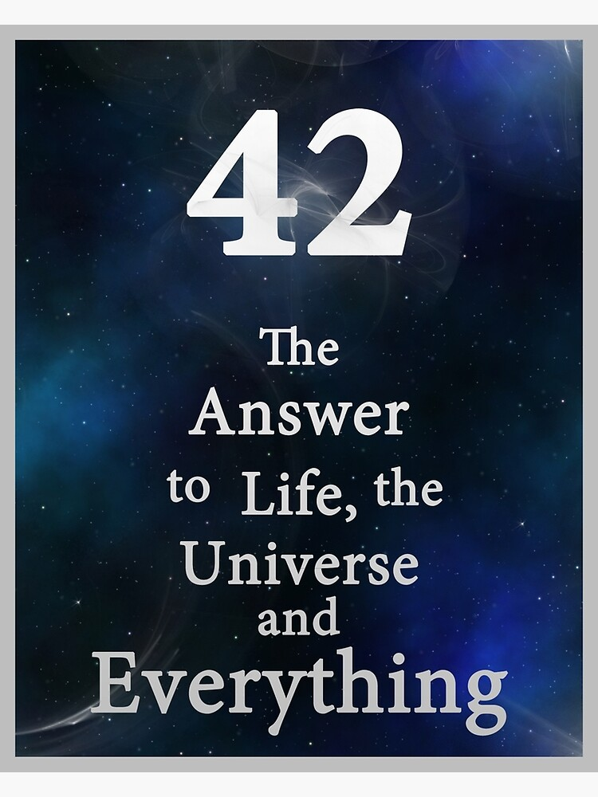
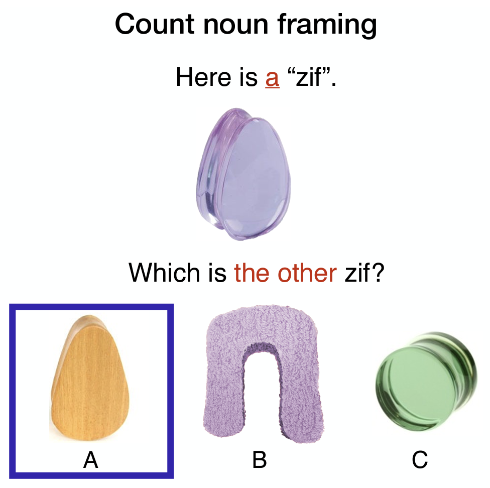
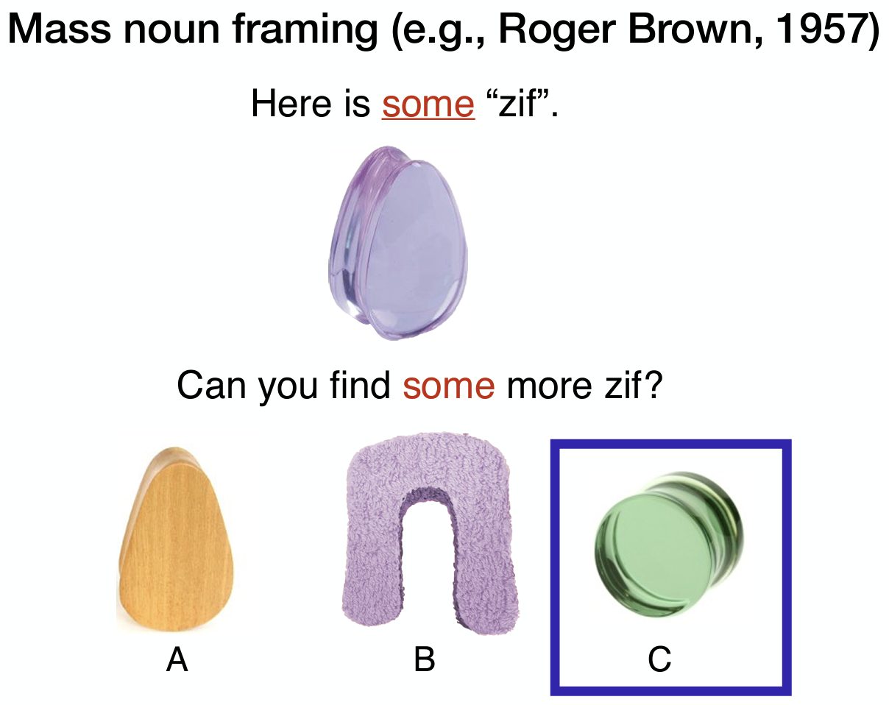
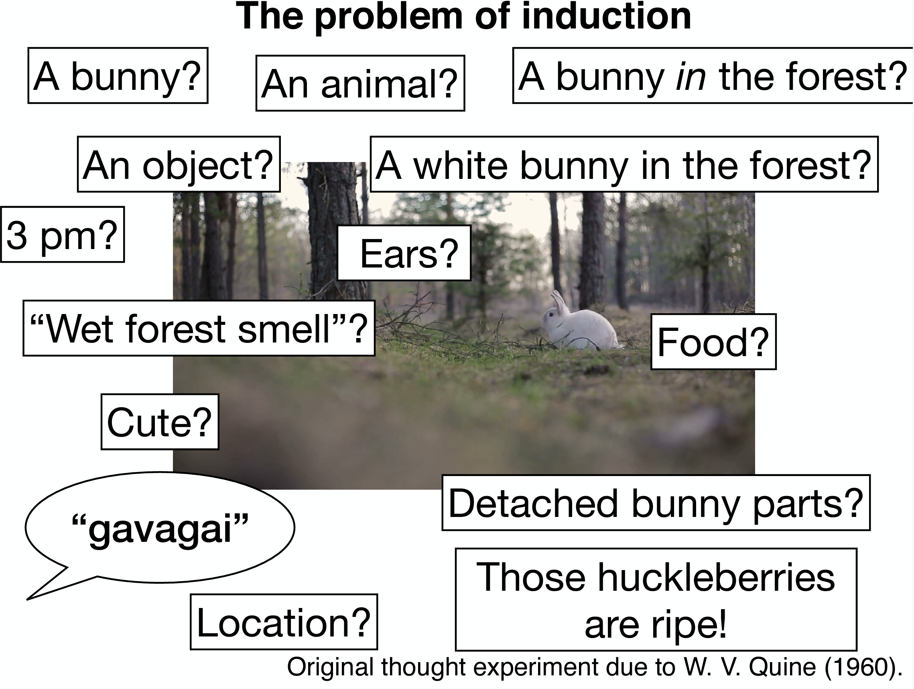
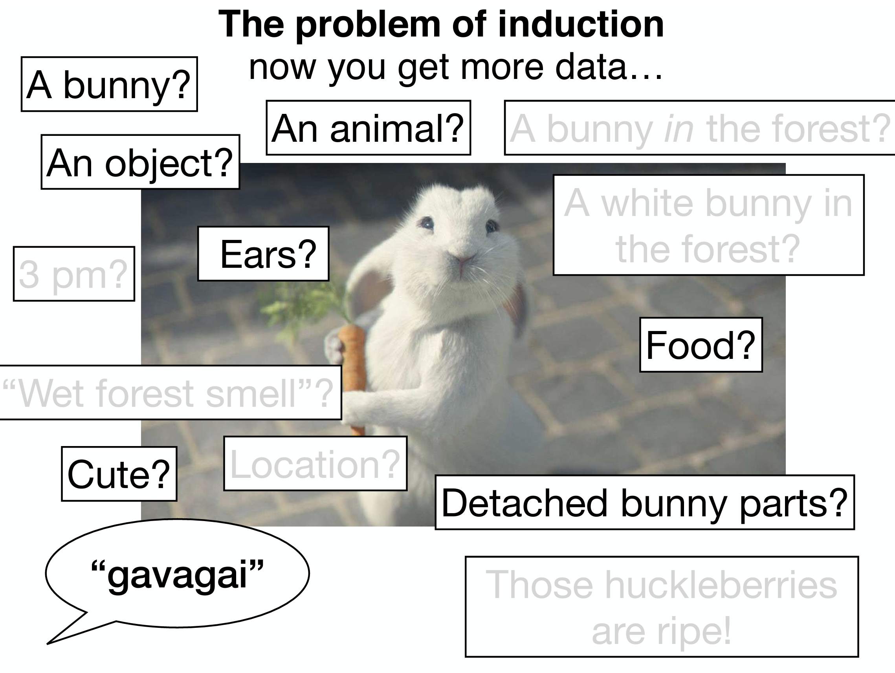
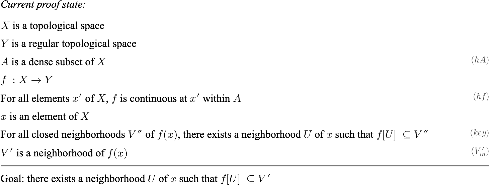

<!---
https://marp.app/docs
https://github.com/rnd195/my-marp-themes/blob/main/beamer.css
-->

# <!--fit--> AI2Reason

Build and characterize artificial reasoning system that is truth-seeking, persuasive, and creative.

By Zory Zhang @ 

<aside>
Version:
- elevator pitch (30s)
- talk with professors (10min): detaillevel0
- talk with interested senior (20min): detaillevel1
- talk with potential collaborators (40min): detaillevel2

Audience can ask for more elaboration on any part of the talk after the standard presentation.
</aside>

# Outline
Goal: introduce and ask for opinions on my long-term vision of AI2Reason.

*  What's AI2Reason
*  Why important at this moment
*  Why is it hard but promising now
*  My Next step

<!-- headingDivider: 2 -->
<!-- footer: 2024 Jan, Zory Zhang: Build and Characterize Artificial Reasoning System -->
<!-- paginate: true -->

#  What's AI2Reason

Outline recap:
1. #### **What's AI2Reason**
    - A. What's reasoning
    - B. Goals of AI2Reason
    - C. What aspects of intelligent system are covered
    - D. What aspects of intelligent system are NOT covered
2. Why important at this moment
3. Why is it hard but promising now
4. My Next step

## A. What's reasoning
* Rapidly growing subfield of Cognitive Science
    - Multivalent
* Abstraction & categorization :arrow_right: **generalizable**
    - Different levels of abstraction
    - Manipulate over abstract entities
* From everyday problem-solving to scientific innovation
    - Let me exemplify

---

### From **solving math problems**
- Representative problem-solving skill
    - Huge individual difference
    - People think those who are good at math are smart

### To **general problem-solving**
- Detective games / "Where did I put my key?"
- Plan a wedding
- ...

---

### To serve as a **scientific enquiry assistant**

* Try to **explain** observation
* By generating **hypothesis**
* Reasoning on hypothesis
    * Get **implications** / predictions
    * Thought / real world **experiment** to exam predictions
    * **Revise** hypothesis

(Counterexample: give conclusion w/o observation or experiment)

---

### To **develop new theory**
Go beyond case-by-case abstraction

1) Repeated experience :arrow_right: learn **schema**
2) :arrow_right:  New **concepts**
3) :arrow_right:  Scientific concept / **diagram** innovation
    - E.g. weight of object :arrow_right:  universal gravity

<detaillevel3>

## B. Goals of AI2Reason

1. Qualities
* **Truth-seeking** (objective): mitigate bias and fallacy
* **Persuasive** (show-your-step): provide good justification
* **Creative** (insightful): less patterned when possible

[When you don't show your reasoning...]

## B. Goal of AI2Reason (cont')
2. Viewpoints
* **Building**: ask for powerful **artificial** intelligence
* **Modeling**: use computational model to **formalize** theories of **human** intelligence.
    - Psychological/descriptive/behavioral observation
    - Philosophical/normative/prescriptive theory
* **Characterizing**: both work on **intelligence**, therefore suggest **plausible** approaches to achieve intelligence.

## B. Goal of AI2Reason (cont')

* :x: Just build powerful model
* :heavy_check_mark: But **characterize** potential approaches to let artificial intelligence be **truth-seeking, persuasive, and creative**

## C. What aspects of intelligent system are covered?
<aside>
These are just some terminologies for people who happen to know them.
</aside>

- Deductive, inductive, abductive reasoning (Peirce)
- Categorization and conceptualization
- Planning
- Causality

## C. What aspects of intelligent system are covered? (cont')

- All of them can be exemplified in doing math
- :arrow_right: My playground/comfort zone
    - Math is the most abstract and formal yet established language we have.
    - The best way for me to test the reasoning ability of an AI system.

<detaillevel1>

  

  

</detaillevel1>

## D. What aspects of intelligent system are **NOT** covered?
<aside>
We are not as ambitious as you might think. I'd like to clarify some limitations of the diagram for now.
</aside>

- Perception / visual reasoning / embodied reasoning
<aside>

- The input/output is already in / will be a symbolic form, e.g. mathematical formal language, causal relation graph, etc.
- Goal of reasoning is already given and assumed to be understood.

TODO: draw diagram on perception -> cognition
</aside>

- Decision-making and ethics
<aside>

- As an assistant.
</aside>

- Consciousness / self-awareness / active learning
<aside>
The motivation of seeking explanatory power, creativity, and the desire to reason are hard-coded in the system. In other words, a zombie AI that has no consciousness.
</aside>

- Latency / efficiency / scalability

# 2 Why important at this moment

Outline recap:
1. What's AI2Reason
2. #### **Why important at this moment**
    - A. Necessity
    - B. Readiness
    - C. Mutual benefit
    - D. Social impact
3. Why is it hard but promising now
4. My Next step

## A. **Necessity**

LLMs **dream/hallucinate/bullshit** because they care about:
* :heavy_check_mark: what word will highly likely follow the previous
* :heavy_check_mark: entertain human
* :x: truth and reasons

We :hearts: LLMs because:
* :heavy_check_mark: stochastic Language Processing Units (LPUs) <a href="#footnote-1">[1]</a>
* :heavy_check_mark: creativity
*  :x: intelligent sys w/ **generalizability**

## B. **Readiness**
- More feasible than ever. We can
    - :repeat_one: **neuralize** many modules via auto-differentials
    - :speech_balloon: utilize infinite expressive power of **natural language**
    - :thought_balloon: LLMs as working (not satisfying) "**creative engine**"
- GPT-4 system:
    - A working (and not that bad) example of such sys
## B. **Readiness** cont'
- **Cognitive scientists** have been studying reasoning for a while
    - Relatively complete charaterization of the analogical reasoning procedure
- **Formal method community & philosophers** have been studying logic for a while
    - Expressive formal logic: dependent type theory
    - Lay out the foundation of deduction
- **ML** model as inductive reasoner

## C. **Mutual benefit**
Mutual benefit between "**building**" :left_right_arrow: "**modeling**"
* :arrow_backward: Inspiration from reasoning theories facilitates AI
* :arrow_forward: Computational model help to **formalize** theories
    - Find and fill in practical gaps
* Characterization: suggest feasible instantiation or alternatives

## D. **Social impact**
* :mortar_board: Educational **diagram** of reasoning for future generations.
* :two_men_holding_hands: Promote interdisciplinary collaboration. By promoting AI2Reason, we help foster an **environment** where researchers collaborate to advance AI technology more holistically.
* :high_brightness: Positive future for humanity: **advancing boundary** of intelligence, shape the future of humanity positively

<aside>
- AI2Reason can be an educational diagram for future generations to practice their reasoning skills, as an act to improve humanity.
- After all, researchers in academia are motivated by the desire to contribute to advancements that could shape the future of humanity positively.
</aside>

# 3 Why is it hard but promising now

Outline recap:
1. What's AI2Reason
2. Why important at this moment
3. #### **Why is it hard but promising now**
    - A. Human is so smart
    - B. My point of view
    - C. Under this view, how to frame the problem?
    - D. What's different from before?
4. My Next step

## A. Human is so smart
"Humans can capture concepts in so little context, mimic rules from so few examples, yet still be able to generalize to genuinely new situations."

(Concept learning)

    

    

## A. Human is so smart (cont')
- Abstraction & categorization
    - Family resemblance: no single feature is common to all members of a category
- Structural relational understanding is uniquely human
    - Not even GPT-4 <a href="#footnote-1">[2]</a>

## B. My point of view for AI2Reason
* People know LLM sucks in reasoning
    - Tried **heuristic-based** methods
    - Most try to improve its "performance" on "benchmarks"
* Yet few people **sit down and think about what reasoning is**.
    - Cognition >> pattern matching. Why expect to solve reasoning in just a couple of years?
* Long history in cog sci. Why not learn from them?

## C. My framing of the problem
1. Auto-differential **neural-symbolic** model
- A. **High inductive bias**
    - :arrow_right: **High data / sample efficiency** :+1:
    - :arrow_right: **Less flexible** (opposite to data-driven) :-1:
    - :arrow_right: A **preliminary** plan; only suitable for early stage
- B. Only use neural components when necessary
    - Interpretability

## C. My framing of the problem (cont')
1. **Auto-differential** neural-symbolic model
- Back-propagation is beautiful yet seductive
- Causality is the elephant in the room

## C. My framing of the problem (cont')
2. Start with **mathematical formal language** as **gymnasium / playground**
- **Verifiable**: the proof can be certificated. IOW, a simplified world model of math that tells consequences of proposed actions.
- Nice **special case** to work on before generalizing to other domains
- Can exemplify **many reasoning abilities** and all hard

## C. My framing of the problem (cont')
3. Low-hanging fruit: deliberate reasoning
- Core: **Working memory** - Long-term memory interaction
- Mechanism: system 2 **supervises** system 1 and takes over when necessary
- Property: **flexible** computation time

## D. What's different from before?
Why hasn't been solved before but promising now?
* Automated theorem proving is getting more and more attention. Better tools and **infrastructure** are built.
* Language is powerful.
    - LLMs enable the connection of different modules.
    - The stronger LLMs become, the better quantitative performance the system can show.

# 4 My Next step
Outline recap:
1. What's AI2Reason
2. Why important at this moment
3. Why is it hard but promising now
4. #### **My Next step**
    - Study reasoning process in doing math

## <!---fit---> Study reasoning process in doing math
* Humans favor **insightful** proofs
* Humans learn from **motivation** of proofs
* Humans perform **different kinds of reasoning** when doing math
    - Draw analogy to connect past experience with present
    - ...

## <!---fit---> Study reasoning process in doing math cont'

* Automated theorem proving? Again, a playground that is well-defined and established.

* **Verifiable** mathematical formal language: a preliminary interface between humans and computers in doing proof

## Seek organic integration for symbolic
- automated planner & automated logical solver
    - E.g. LLM-modulo
- how to go beyond "neural-symbolic" inference
    - want if I want to train?

<detaillevel1>
<figure>
    
    <picture>
    
    </picture>
    <figcaption><t>A demo by Patrick Massot</t></figcaption>
</figure>
</detaillevel1>

# 5 Me >_<

- https://zoryzhang.notion.site
- zoryz2@illinois.edu
- zory_zhang@X;
- zoryzhang@wechat

Join Discord right now to see what exciting things are happening! We welcome everyone interested in this direction

Thank You! Q&A time!

**AI2Reason Community@Discord**

# References

<ol>
<li id="footnote-1">Taken from Omar Khattab. (https://twitter.com/lateinteraction/status/1736119027997831210)</li>
<li id="footnote-2">Emergent analogical reasoning in large language models.</li>
</ol>

# Backup slides
- E.g. Ask "show me why gcd (n,n-1) = 1":

  

---

<iframe src="./mindmap_231217.html" height="100%" width="100%" frameBorder="0"></iframe>