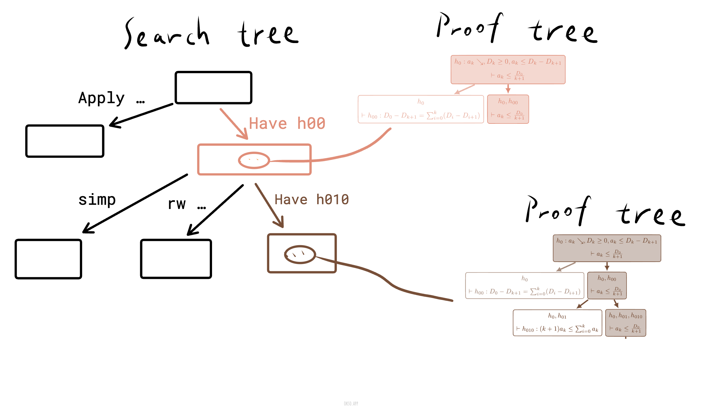

<!---
https://marp.app/docs
https://github.com/rnd195/my-marp-themes/blob/main/beamer.css
-->

# <!--fit--> AnalogyTP

Approaching Abductive Reasoning via Analogical Theorem Proving

By Zory Zhang @ 

# Motivation
Can AI reason on a dynamic mathematics theorem library to generate not only verifiably correct but also human-like hierarchically structured and insightful proofs for new theorems?

<!-- headingDivider: 2 -->
<!-- footer: 2024 Jan, Zory Zhang: "AnalogyTP: Approaching Abductive Reasoning via Analogical Theorem Proving" -->
<!-- paginate: true -->

# Reasoning & Planning
* Theorem proving can be viewed as seeking the best explanation of a statement.
* The goal of achieving a valid proof can be viewed as a planning problem.
* A goal can be decomposed into independent subgoals when given hypothesis ("we claim that ..."). This process of hypothesis generation is abductive reasoning.

# Analogy

- Use analogical inference to suggest a hypothesis.
- Analogy is conducted by explicitly constructing a translation mapping between scenarios and translate the goal decomposition used in the target scenario back to the source scenario.
- E.g. Telescoping trick.

---

<embed src="./telescope1.pdf" width="100%" height=600px type="application/pdf">

<embed src="./telescope2.pdf" width="100%" height=600px type="application/pdf">

# Planning
- Interactive proof assistant can be viewed as a world model for theorem proving that predicts consequences of proposed actions, which enables planning.
    - IOW, formal math as a special case of general planning.
    - We suggest to implement inference-to-the-best-explanation via a new planning policy based on searching for a divide-and-conquer strategy that reduces the difficulty the most.

## Planning policy

---
- Assume we have a objective estimator to evaluate difficulty.
- Prioritize *search tree* branch (tactic) that minimize the value of cost function = $\max_{\text{existing subgoals } s} \{ \text{difficulty}(s) \}$, which is defined on *proof tree*.

# Conclusion
- While analogy provides motivation of the proof, the planning policy encourages the proof to be hierarchically structured and insightful.
- We implement this framework using a neural-symbolic architecture and show that it mitigate the gap between AI and human mathematician on the quality of the produced proof.