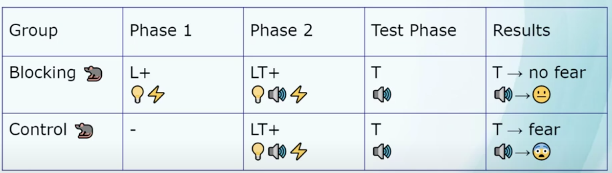

<!---
https://marp.app/docs
https://github.com/rnd195/my-marp-themes/blob/main/beamer.css
-->

# <!--fit--> Blocking in Category Learning

Bott, L., Hoffman, A. B., & Murphy, G. L. (2007). Blocking in category learning. Journal of Experimental Psychology: General, 136(4), 685.

Present by Zory Zhang @ 

# Outline
Goal: Convey that (external) error-based learning is not the sole mechanism of human learning.

*  Demo of Exp.3
*  Research Question
*  Exp.3 Settings
*  Exp.3 Results
*  Implications

<!-- headingDivider: 2 -->
<!-- footer: 2025 Apr, Zory Zhang: Blocking in Category Learning -->
<!-- paginate: true -->

#  Demo of Exp.3
Are we ready?

---

Manual transmission

---

Automatic transmission

---

Manual transmission

---

2 doors Automatic transmission Front Wheel Drive

---

low tone

---

4 doors Manual transmission Front Wheel Drive

---

high tone

---

Front Wheel Drive Automatic transmission 4 doors

---

low tone

---

Automatic transmission 2 doors Rear Wheel Drive

---

low tone

---

Manual transmission 4 doors Rear Wheel Drive

---

high tone

---

2 doors Front Wheel Drive Automatic transmission

---

low tone

---

Manual transmission 4 doors Rear Wheel Drive

---

high tone

---

Rear Wheel Drive Manual transmission 2 doors

---

high tone

---

2 doors

<!-- Low tone -->

---

Rear Wheel Drive

<!-- High tone-->

---

4 doors

<!-- High tone -->

---

Front Wheel Drive

<!-- Low tone -->

## How do you feel?
Tricked?
Focused too much on the manual/automatic transimission?

---
Def. **Blocking effect** in associative learning <a href="#footnote-2">[2]</a>.

* Is explained as consequence of behavioral-error-driven learning.
* Blocking -> no error in Phase 2 -> do not learn

##  Research Question
* Question: Is category learning purely behavioral-error-driven as well?
* Use blocking to produce new evidences!
    
## Outline
*  Demo of Exp.3
*  Research Question
*  Exp.3 Settings
*  Exp.3 Results
*  Implications

#  Exp.3 Settings
* Conditions:
    * blocking condition: One feature predictive of category.
    * control condition: No single feature predictive of category.
* Prediction:
    * If yes, when there is almost no behavioral error (blocking), subjects will learn much fewer features of the categories then when they make errors (control).
    * If no, smaller difference between two conditions.
    
4 conditions. Formally the same material between *tasks*.

 

#  Exp.3 Results

#  Implications
* Totally expected: To **learn about** a category, you **should** get information about it as much as you can, beyond what you need to categorize.
* Because the whole purpose of having categories is to support **generalization** (something about x might be true for y because of the same category).
* Predicting outcomes is another story: people assume number of causes = 1.

# Thank You! Q&A time!

# References

<ol>
<li id="footnote-1">Bott, L., Hoffman, A. B., & Murphy, G. L. (2007). Blocking in category learning. Journal of Experimental Psychology: General, 136(4), 685.</li>
<li id="footnote-2">https://www.youtube.com/watch?v=N4aq7PoH0Dc</li>
</ol>

# Backup slides
