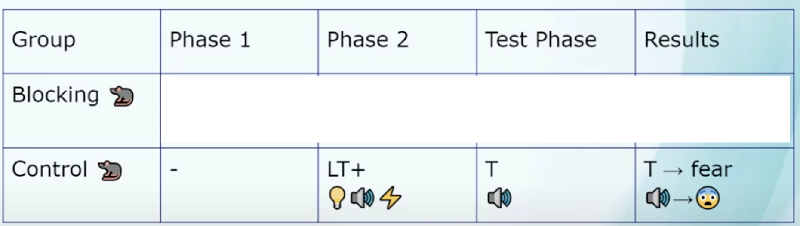
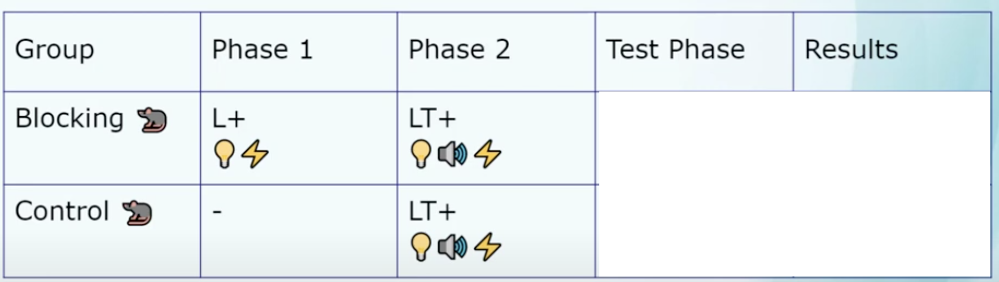
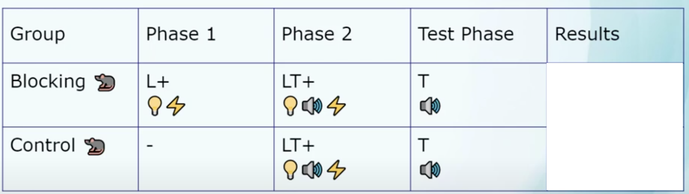
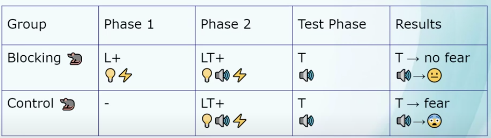
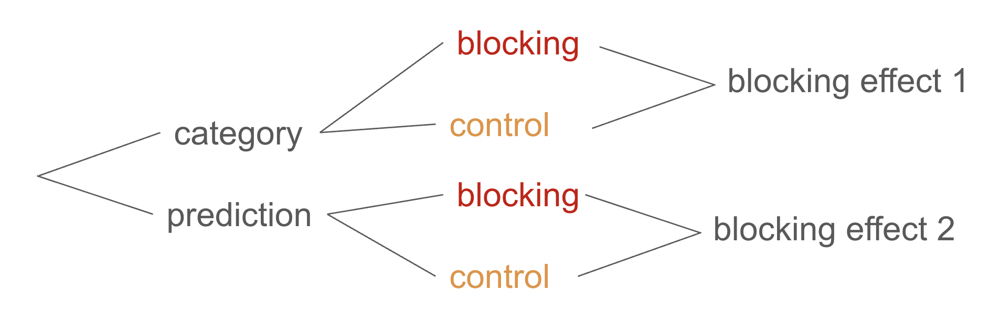
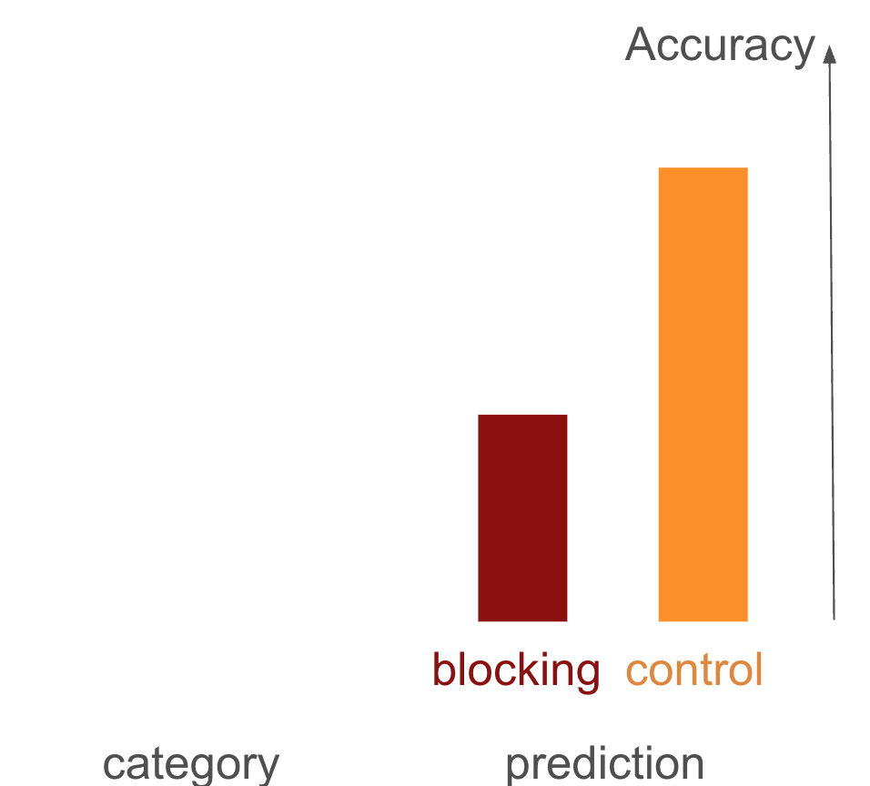
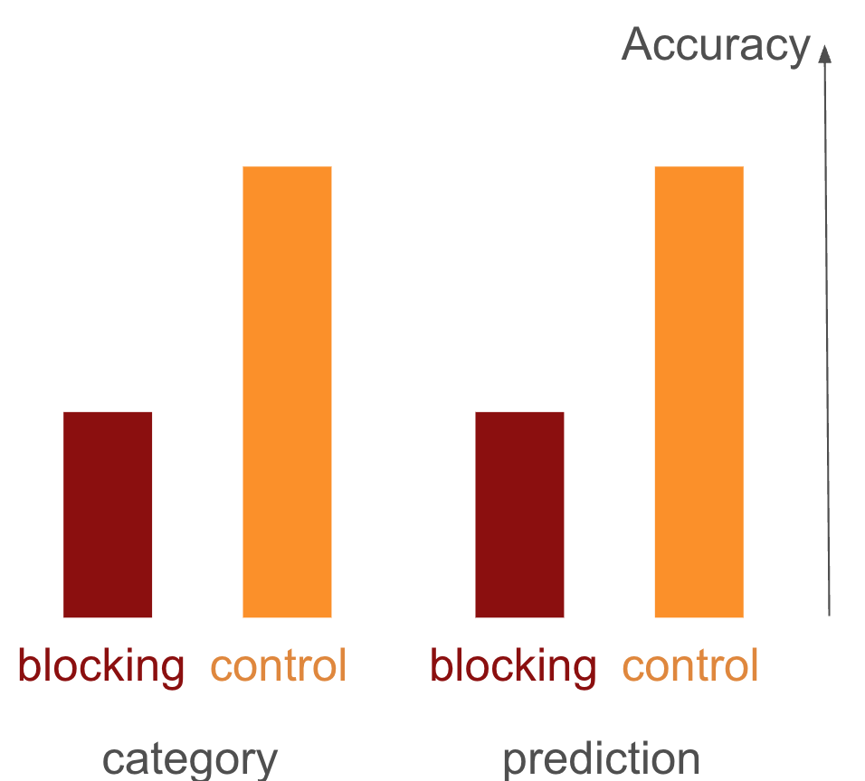
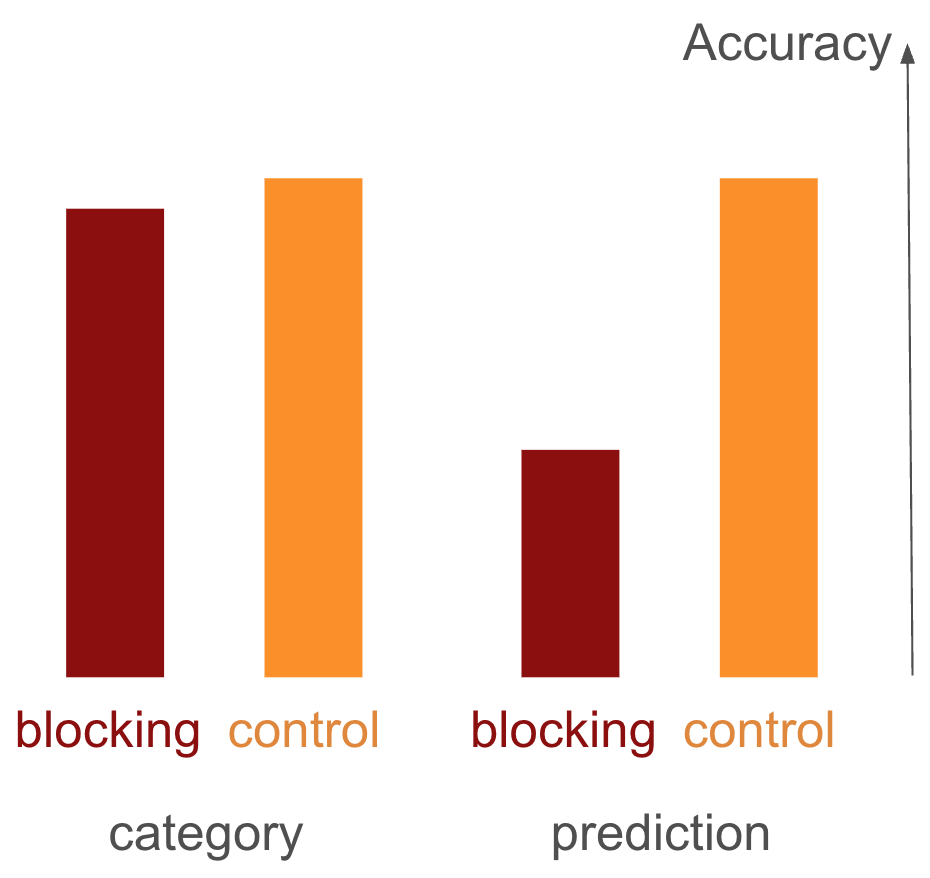
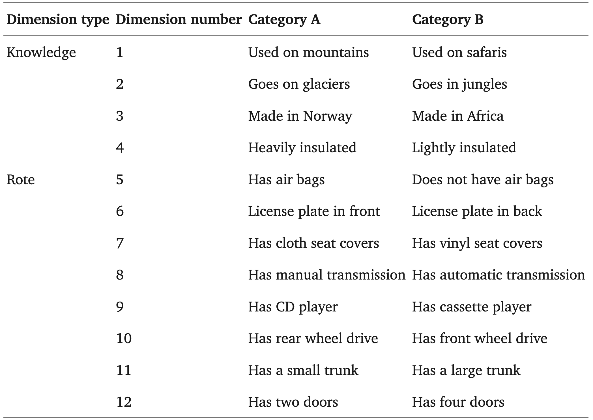

<!---
https://marp.app/docs
https://github.com/rnd195/my-marp-themes/blob/main/beamer.css
-->

# <!--fit--> Blocking in Category Learning

Bott, L., Hoffman, A. B., & Murphy, G. L. (2007). Blocking in category learning. Journal of Experimental Psychology: General, 136(4), 685.

Present by Zory Zhang @ 

# Outline
Goal: Convey that (external) error-based learning is not the sole mechanism of human (category) learning.

-  Demo of Exp.3
-  Research Question
-  Exp.3 Settings
-  Exp.3 Results
-  Implications

<!-- headingDivider: 2 -->
<!-- footer: 2025 Apr, Zory Zhang: Blocking in Category Learning -->
<!-- paginate: true -->

#  Demo of Exp.3
Are we ready?

---

Not juicy

---

high tone

---

Juicy

---

low tone

---

Not juicy

---

high tone

---

Juicy

---

low tone

---

Not juicy

---

high tone

---

Big Juicy Red

---

low tone

---

Small Not juicy Red

---

high tone

---

Red Juicy Small

---

low tone

---

Juicy Big Green

---

low tone

---

Not juicy Small Green

---

high tone

---

Big Red Juicy

---

low tone

---

Not juicy Small Green

---

high tone

---

Green Not juicy Big

---

high tone

---

Big

<!-- Low tone -->

---

Green

<!-- High tone-->

---

Small

<!-- High tone -->

---

Red

<!-- Low tone -->

## How do you feel?

Actually low = {big, juicy, red} = prototype
Should be extremely easy if a little bit attention
Tricked?
Focused too much on the juicy/nonjuicy?

---
Def. **Blocking effect** in associative learning <a href="#footnote-2">[2]</a>.

---

---

---

* Explained as consequence of behavioral-error-driven learning.
<!--Prototypical phenomenon of error-based learning
* Blocking condition -> can already predict shock based on light before phase 2 -> no prediction error -> don't learn new association-->

##  Research Question

* Question: Is category learning purely behavioral-error-driven as well?
* Use blocking to produce new evidences!
* YOU know how to predict outcomes -> no error in predicting -> don't learn other features
    
## Outline
-  Demo of Exp.3
-  Research Question
-  Exp.3 Settings
-  Exp.3 Results
-  Implications

#  Exp.3 Settings
- Materials
    * Pre-experiment instruction: depends on task.
    * Phase 1: depends on condition.
    * Same Phase 2: One feature fully diagnostic of category (YOU: Juicy/Not juicy).
    * Same testing: judge most likely tone/category for each feature.

---
- 2 conditions:
    * blocking condition (YOU): Pre-trained to use the diagnostic feature (YOU: Juicy/Not juicy) in Phase 1 -> Almost no behavioral error during Phase 2.
    * control condition: No such Phase 1 -> Some errors early on duiring Phase 2.
* Now interestingly, 2 pre-experiment *instructions*: 
    * prediction task (YOU): predict high/low tone.
    * category learning task: [let me demo]

---
 4 groups. Between subject.

 

* Blocking effect = accuracy(control) - accuracy(blocking) of feature understanding in Test Phase.

## Prediction: reproducing blocking effect

 

## Prediction 1: if category learning is also error-driven

 

## Prediction 2: if category learning is complicated

#  Exp.3 Results

<!-- prediction blocking at chance level. All others are close to ceiling. -->

#  Implications
* Totally expected. The whole purpose of having categories is to support:
    * **generalization**: something about $x$ might be true for $y$ because of the same category, when you don't know much about $y$
    * **inference**: categorize even when you don't know about the all features of it + (make judgement on the ground of category)
* To **learn about** a category, you **should** get information about it as much as you can, beyond what you need to *categorize* future items.

---
- Predicting outcomes is another story: 
    * even when beyond associative learning, people assume number of causes = 1 when learning a new causal system. 
    * People assume the contrary in real-world categories.
* "Learners' construal of the task determines what they learn."
* Big deal back then: many theories of category learning assumed an error-driven mechanism.
* Still largely true today.
* Comment: I think they should have measured and reported reaction time.

## Relevance
* Linguistic priming: Lexical/syntactic/verb-bias/phonotactic priming (Quite differrent from visual/auditory priming)
* Evidence: The more surprising the prime is, the stronger error.
* Thoery: Priming as error-based implicit learning. 
* Blocking in phonotactic learning?
* Clarification: FierceFire3 does not emphasize error-based learning. It is about using patterns in speech errors to reveal our implicit knowledge. See "Tuning the blueprint" paper for this mindset.

# Thank You! Q&A time.

# References

<ol>
<li id="footnote-1">Bott, L., Hoffman, A. B., & Murphy, G. L. (2007). Blocking in category learning. Journal of Experimental Psychology: General, 136(4), 685.</li>
<li id="footnote-2">https://www.youtube.com/watch?v=N4aq7PoH0Dc</li>
</ol>

# Backup slides
Conforming to the theory theory account, it appears that people have a hypothesis about how data is generated (#cause=1 or "they are categories") that is influenced by testimony.

## Stimuli Summary

 

## Exp. 1 & 2
Learning real-world categories with thematic and causal knowledge (exp.1) or no knowledge (exp.2).
- blocking condition: One feature fully diagnostic of category. Almost no behavioral error.
- control condition: No feature fully  diagnostic of category. Quite some behavioral errors.

# Exp. 3
- 4-6 epoches (blocks) of learning stimuli
- 2 epoches (blocks) of 16 features (8 dimensions) -> 32 judgements
- Categories named Mobbles and Streaths
- This will also be a feedback text "correct/incorrect" on the screen, ofc, after each judgement during training.

---
- Phase 2 (On non-defining features only)
    - Category control >> prediction control
    - Category learning lets you learn faster (in control condition)
    

 

---
- Test Phase
    - Prediction task blocking effect p<.05
    - Prediction blocking condition at chance level, p=.24