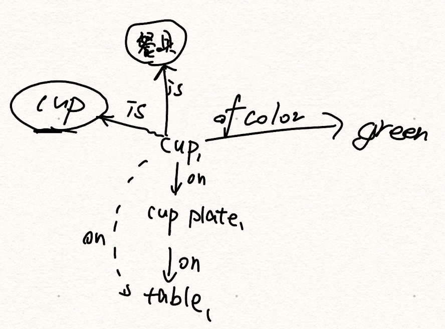
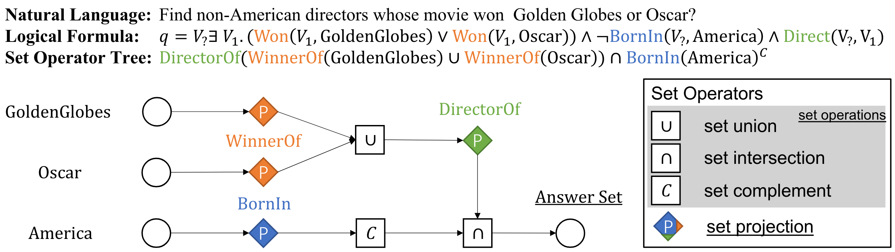
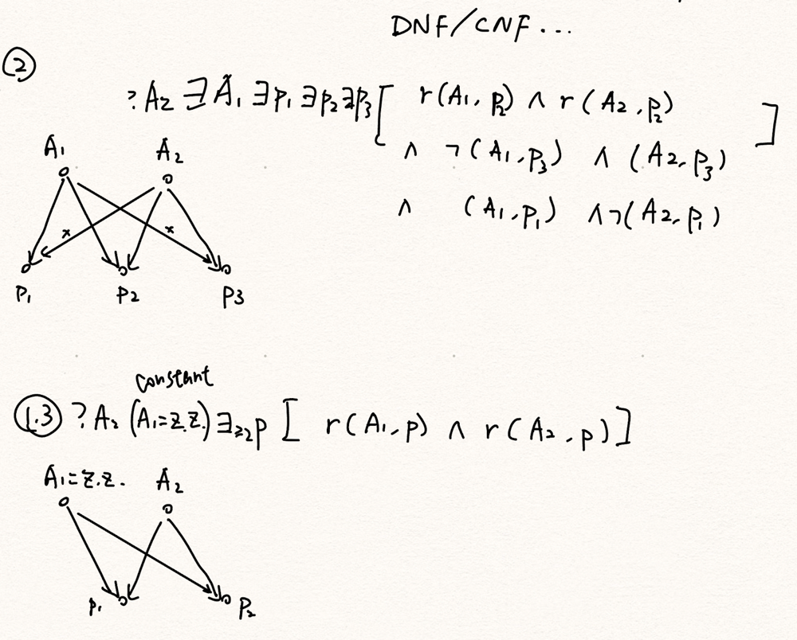
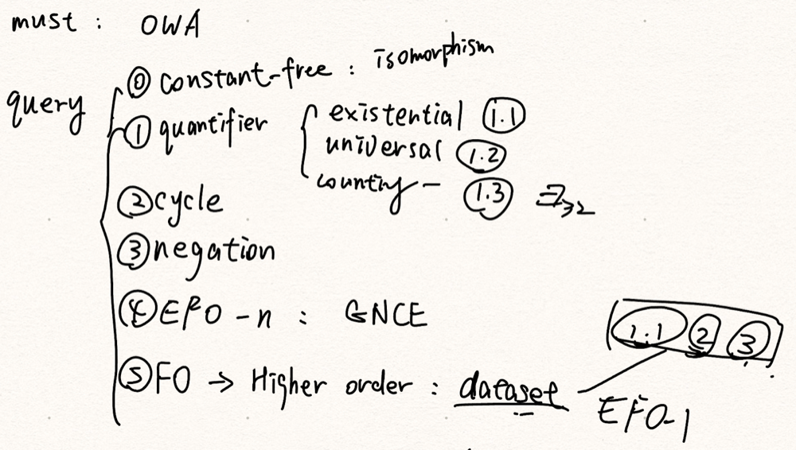

<!---
https://marp.app/docs
https://github.com/rnd195/my-marp-themes/blob/main/beamer.css

add for title autofitting
-->

# <!-- fit --> Academic Experience Report

By Zory Zhang

# Outline
Goal: to introduce myself as a learner with unlimited potential.

1. Background
2. Course Project Experience
3. Research Project Experience

<!-- headingDivider: 3 -->
<!-- footer: 2023 May, Zory Zhang -->
<!-- paginate: true -->

# 1 Background
- Coursework
- Algorithm design for Olympic

## 1.1 Coursework
<!-- header: Coursework -->

### Various rigorous mathematical courses
- Honors Calculus I[A+] & II
- Multivariable Calculus[A]
- Honors Mathematical Analysis[A]
- Honors Discrete Mathematical Tools for Computer Science [A+]
- Honors in Linear and Abstract Algebra I [A]
- Honors Probability [in progress]
- **In short, most theoretical**
### Intensive and advance courses
- Deep Learning in Computer Vision [A] (almost Stanford CS231N teached by **Fei-fei**)
- Machine Learning with Structured Data [A] (almost Stanford CS224W teached by **Jure**)
- Advanced Algorithms [A]: a **graduate** algorithm course
- **Operating Systems[A]** and Machine Architecture[A-] at the UC Berkeley

### Board computer science courses and projects
Honors Object-Oriented Programming and Data Structures [A+]
- Project: HKUST courses curriculum visualization computer application
- Reduces the courses selection time cost and benefits the university community
- https://github.com/zory233/CurriculumMap
---

## 1.2 Algorithm design for Olympic
<!-- header: Algorithm design for Olympic -->
- Ranked 577th at Google international programming competition Codejam 2020 Round 3
- Rating 2313 at codeforeces
- 52-th place in ICPC Asia Regional Contest Jinan Site 2021(Silver medal)
- Runner-up in Tsinghua-HKUST Programming Contest 2022

# 2 Course Project Experience
<!-- header: Course Project Experience -->
1. Deepfake detection using an attention-based inconsistency detector
2. Explore layer combination in LightGCN(Light Graph Convolutional Network)

In short:
- Mainly gained hands-on **scientific** experiment experience
- Not quite innovative works

## 2.1 Deepfake detection using an attention-based inconsistency detector
- Project of HKUST course Deep Learning in Computer Vision (Stanford CS231N)
- Hit the highest score
- Report: https://github.com/ywangmy/comp4471-project/blob/master/COMP4471Report.pdf
- Code: https://github.com/ywangmy/comp4471-project

### My role:
- Phase 1 (idea): brainstorm; claimed to use the discriminator of GAN(fail)
- Phase 2 (experiment coding): 70%
- Phase 3 (experiment): 70%
- Phase 4 (report): 20%

## 2.2 Explore layer combination in LightGCN(Light Graph Convolutional Network)
- Project of HKUST course Machine Learning with Structured Data (Stanford CS224W)
- Hit the highest score

### Results
- Empirically show the new coefficients speed up the convergence
- Code: https://github.com/zory233/4222project
- Report: https://drive.google.com/file/d/1P0kYxm15FVaTF0CnkMtIlqMfNgfa7ylw/view?usp=share_link
- Present slides: https://docs.google.com/presentation/d/1WtUXt_FGys5tZklDcZuJaMPR7Dr75EiMey6KN4vn5E8/edit?usp=share_link

### Idea of LightGCN
- Essense: remove non-linearity from GCN
- Notation of metric: normalized adjacency matrix $\tilde A$, degree matrix $D$, k-th layer embedding $E^{(k)}$, k-th layer linear transformation $W^{(k)}$.
- To simplify: $E^{(k+1)}=\tilde A E^{(k)} W^{(k)}$
- i.e. $E^{(K)}=\tilde A ^K E^{(0)} (W^{(0)} \dots W^{(K-1)})$
- $E_{final}=\frac{1}{K+1} \sum_{k=0}^K E^{(k)}$

### Idea of BiasedGCN
- $E_{final}=\frac{1}{K+1} \sum_{k=0}^K E^{(k)}$ => $E_{final}= \sum_{k=0}^K E^{(k)} \cdot \alpha^{k+1}$
- Solve $\alpha$ from $\sum_{k=0}^K \alpha^{k+1}=1$

### Experiment
- HyperParam tuning: https://htmlpreview.github.io/?https://github.com/zory233/4222project/blob/main/save1.html
- LightGCN (Baseline), BiasedGCN-e (exponentially decaying), and BiasedGCN-t (trainable)
- BiasedGCN-e > BiasedGCN-t > LightGCN

### My role
- Phase 1 (idea): brainstorm; claim the exponential setting
- Phase 2 (experimental trial coding): 0%
- Phase 3 (experiment coding): 60%
- Phase 4 (experiment and report): 90%

# 3 Research Project Experience
- Supervised by Yangqiu Song and work with Zihao Wang (Knowledge Graph Representation and Reasoning interest group)

1. Complex logical query on incomplete knowledge graph

## Complex logical query answering on incomplete knowledge graph
<!-- header: Complex logical query on incomplete knowledge graph -->

- Supposely an author of equal contribution to the first author
- Aimed at ICLR 2023
- In progress

### Background: what's KG

### Background: how's the query
- Task: counting (regression task), ranking (set answer), and classification (answer verrification)
EFO-1: extential first order logic with 1 free variable(the one to count)

### Query graph

### Contribution
- Relax assumption on query graph from tree to general directed graph
- We propose a brand-new coloring test for complex query reasoning over KG.
- Properly deal with negation
- Properly deal with extential quantifier
- Properly deal with open world assumption(incompleteness)

### Baseline
- LMPNN: Logical Message Passing Networks with One-hop Inference on Atomic Formulas (ICLR2023)
- GNCE: Cardinality Estimation over Knowledge Graphs with Embeddings and Graph Neural Networks (arxiv, an incremental work)
- GNN-QE: Neural-Symbolic Models for Logical Queries on Knowledge Graphs (ICML 2022)

### Framework

### My role: mainly the peer reviewer and executor
#### In preparation phase
- Read paper & provide comment
- Discuss twice a week
- Clarify the problem definition & characteristic
---
#### In development phase
- Build the highly automated and scientific experiment environment
- Provided careful evaluation on theoretical framework
- Conduct massive coding.

### My supposed role in the future
- In experiment phase
    - Monitor the experiments
- In paper writing phase
    - Try to write more >_<